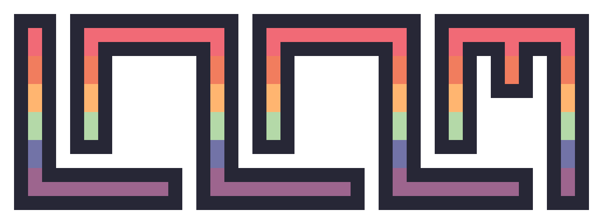

<div align="center" alt="loom">
    
    <p>The declarative, ECS-based game engine, written in zig.</p>
</div>

---

**loom** wraps [Not-Nik](https://github.com/Not-Nik)'s [raylib-zig](https://github.com/Not-Nik/raylib-zig) and uses [johan0A](https://github.com/johan0A)'s [clay-zig-bindings](https://github.com/johan0A/clay-zig-bindings) for UI.

> [!important]
> This project uses zig version `0.14.0` and the latest version of the bindings.

The engine aims to provide a declarative interface for game development. We try to provide a _"code only Unity"_, where you only have to configure scenes and entities with only a few lines of code.

## Install loom

Adding loom is easy, just follow these steps:

1. Fetch the package.

   ```sh
   zig fetch --save git+https://github.com/zewenn/loom
   ```

2. Get the module.

   ```zig
   const loom_dep = b.dependency("loom", .{
       .target = target,
       .optimize = optimize,
   });
   const loom_mod = loom_dep.module("loom");
   ```

3. Add the import

   ```zig
   target_module.addImport("loom", loom_mod);
   ```

4. You are ready to go, import loom into you project:
   ```zig
   const loom = @import("loom");
   ```
